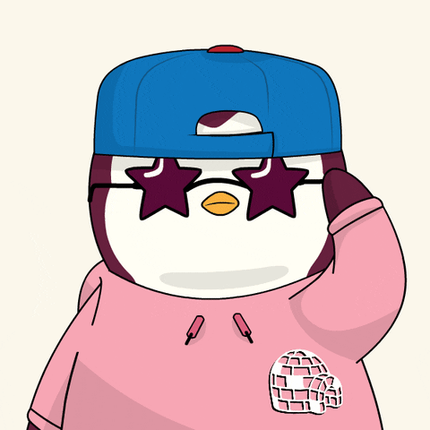

<div style="text-align: center;">
    
</div>
<br>
<div style="text-align: center;">
    <strong style="font-size:15px"><em>Knowing everything is impossible, but the desire to learn something new every day is what makes us <div style="font-size:30px">UNSTOPPABLE.</div></em></strong>
</div>
<br>
<br>

Hi I'm [Ahmed Bassam](https://www.linkedin.com/in/ahmed-bassam-26255719b/)
====================================================================================================================================
<br>
<br>
<div style="display: flex; align-items: center;">
    
    <h1 style="font-size: 2em; margin: 0;">About Me</h1>
</div>
<hr style="border: none; border-top: 1px solid #ccc; margin-top: 5px;">

* 🧑‍💻 Software Engineer [@Takhial](), a company focused on developing AI software applications to big organizations

* 🎓 Bachelor of Engineering in Communication and Information
and Software Engineering Minor at [Zewail City of Science and Technology ](https://www.linkedin.com/school/zewailcityst/posts/?feedView=all)

* 📖 Currently Reading: ```The Art of PostgreSQL``` by [@Dimitri Fontaine](https://tapoueh.org/about/) & [K8s Docs](https://kubernetes.io/docs/home/)

* ❤️ I'm Passionate about Software Engineering, Data Science, Cyber Security. What? This is my heart I can't control it.
### Skills


<p align="left">
<a href="https://docs.microsoft.com/en-us/cpp/?view=msvc-170" target="_blank" rel="noreferrer"></a>
<a href="https://docs.microsoft.com/en-us/cpp/?view=msvc-170" target="_blank" rel="noreferrer"></a><a href="https://docs.microsoft.com/en-us/dotnet/csharp/" target="_blank" rel="noreferrer"></a><a href="https://git-scm.com/" target="_blank" rel="noreferrer"></a><a href="https://dart.dev/" target="_blank" rel="noreferrer"></a><a href="https://developer.mozilla.org/en-US/docs/Web/JavaScript" target="_blank" rel="noreferrer"></a><a href="https://www.python.org/" target="_blank" rel="noreferrer"></a><a href="https://developer.mozilla.org/en-US/docs/Glossary/HTML5" target="_blank" rel="noreferrer"></a><a href="https://www.w3.org/TR/CSS/#css" target="_blank" rel="noreferrer"></a><a href="https://www.mysql.com/" target="_blank" rel="noreferrer"></a><a href="https://dotnet.microsoft.com/en-us/" target="_blank" rel="noreferrer"></a><a href="https://flutter.dev/" target="_blank" rel="noreferrer"></a><a href="https://store.arduino.cc/?gclid=Cj0KCQjw2eilBhCCARIsAG0Pf8uueBifykWcsSS4LPESeGQfxGVKJYnzV7bz471XfknQJy_1VINVWM8aAkLtEALw_wcB" target="_blank" rel="noreferrer"></a><a href="https://www.docker.com/" target="_blank" rel="noreferrer"></a><a href="https://www.linux.org" target="_blank" rel="noreferrer"></a>
</p>


### Socials

<p align="left"> <a href="https://www.facebook.com/ahmed.bassam.3975/" target="_blank" rel="noreferrer"> <picture> <source media="(prefers-color-scheme: dark)" srcset="https://raw.githubusercontent.com/danielcranney/readme-generator/main/public/icons/socials/facebook-dark.svg" /> <source media="(prefers-color-scheme: light)" srcset="https://raw.githubusercontent.com/danielcranney/readme-generator/main/public/icons/socials/facebook.svg" />  </picture> </a> <a href="https://www.github.com/besology512" target="_blank" rel="noreferrer"> <picture> <source media="(prefers-color-scheme: dark)" srcset="https://raw.githubusercontent.com/danielcranney/readme-generator/main/public/icons/socials/github-dark.svg" /> <source media="(prefers-color-scheme: light)" srcset="https://raw.githubusercontent.com/danielcranney/readme-generator/main/public/icons/socials/github.svg" />  </picture> </a> <a href="https://www.linkedin.com/in/ahmed-bassam-26255719b/" target="_blank" rel="noreferrer"> <picture> <source media="(prefers-color-scheme: dark)" srcset="https://raw.githubusercontent.com/danielcranney/readme-generator/main/public/icons/socials/linkedin-dark.svg" /> <source media="(prefers-color-scheme: light)" srcset="https://raw.githubusercontent.com/danielcranney/readme-generator/main/public/icons/socials/linkedin.svg" />  </picture> </a></p>

### Badges

<b>My GitHub Stats</b>

<a href="http://www.github.com/besology512"></a>

<a href="http://www.github.com/besology512"></a>

<a href="https://github.com/besology512" align="left"></a>

<b>Top Repositories</b>

<div width="100%" align="center"><a href="https://github.com/besology512/Car-Store" align="left"></a><a href="https://github.com/besology512/paint-play" align="right"></a></div><br /><br /><br /><br /><br /><br /><br />

<br /><br /><br /><br /><br />

<div width="100%" align="center"><a href="https://github.com/besology512/OS-second-project" align="left"></a></div>
